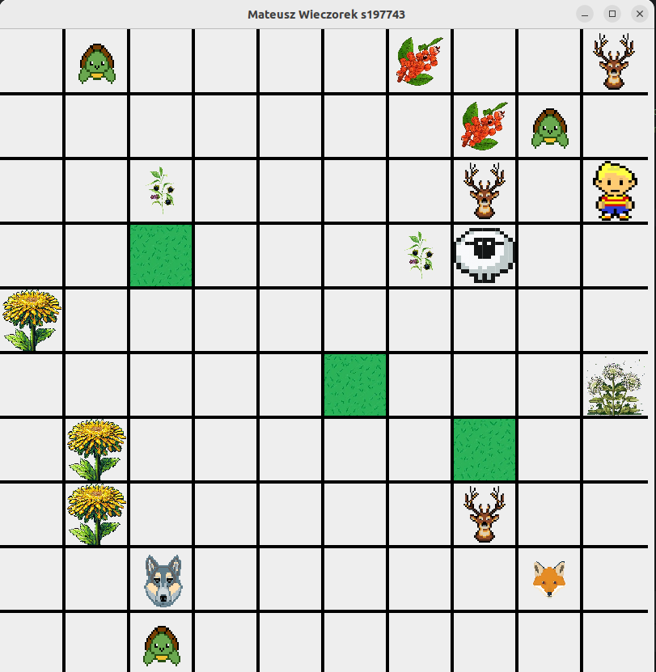
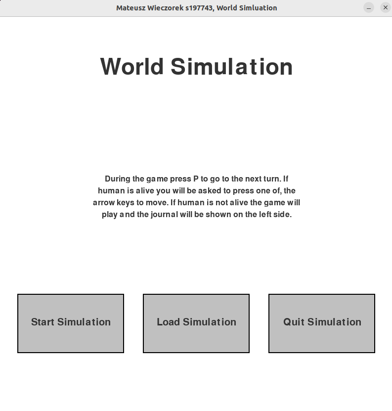
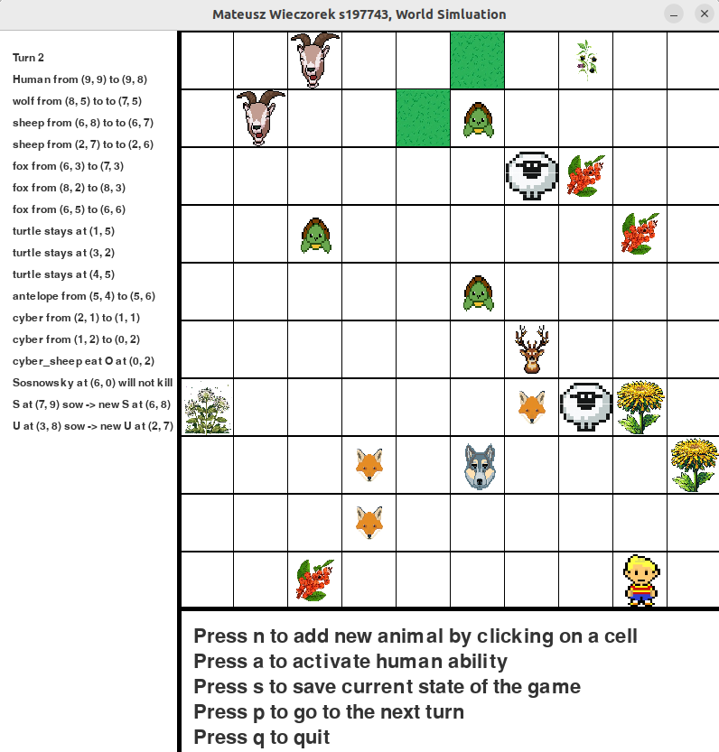
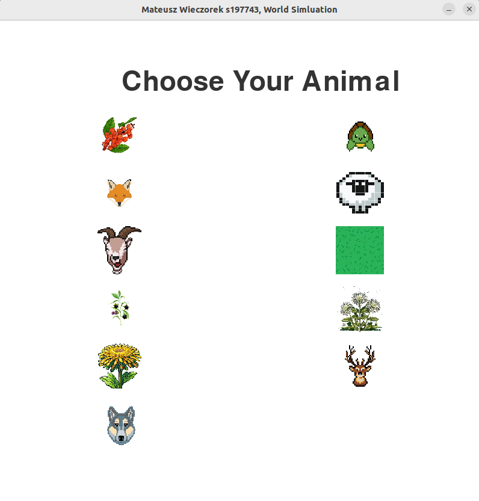

# GameOfLife

This repository contains a Game of Life simulation implemented in three programming languages: C++, Java, and Python.

- The C++ project uses the console to display the entire simulation.
- The Java implementation utilizes Swing for the graphical user interface.
- The Python version utilizes the Pygame framework for visualization.

Feel free to explore each implementation and experiment with the Game of Life simulation in different programming environments!

## Running the C++ Project

Before running the C++ project, ensure you have Microsoft Visual Studio installed on your system. Follow these steps to run the project:

1. Clone the repository to your local machine using Git:
    ```
    git clone <repository_url>
    ```

2. Open Microsoft Visual Studio.

3. Navigate to File > Open > Project/Solution and select the C++ project file (`.sln`) from the cloned repository directory.

4. Once the project is loaded in Visual Studio, press F5 or click on the green "Start" button to build and run the project.

5. If you want to save the state of your game your files will be in `./filenames` folder.

Enjoy exploring the C++ implementation of the Game of Life in Microsoft Visual Studio!


## Running the Java Project

I used the Swing library to build this Game of Life simulation. If you want to clone this repo with the Java project, you have to clone the submodule:

```sh
git clone --recurse-submodules https://github.com/Mateusz-best-creator/GameOfLife.git
```

Once you've cloned the project, you can open your IDE and start the game! Messages about what is going on are displayed in the console. You can click on an empty cell and then decide by typing the appropriate character in the console what kind of organism you want to add. At the beginning you have to type board height and width, then at the start of the turn, you can:

- Press `p` to play
- Press `s` to save the state of the game to a file
- Press `r` to read the state of the game from a file

Once you've clicked `p`, you can use the arrow keys to move the human if they are alive or press `s` to activate the human's special ability, which temporarily increases their strength.




## Running the Python Project

This is a Python GameOfLife project. To run it, you need to have Python installed along with the Pygame framework on your computer. You can check your Python version by typing:

```
python --version
```
or
```
python3 --version
```

To check if Pygame is installed, run:

```
pip show pygame
```

To get started, clone this repository using SSH or HTTP:
```
git clone <url>
```

And then execute:

```
python main.py
```
or
```
python3 main.py
```

The entire project should launch, and you should be able to play!




