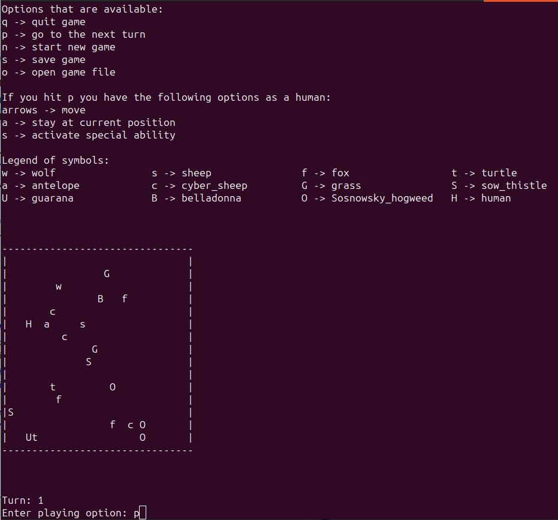
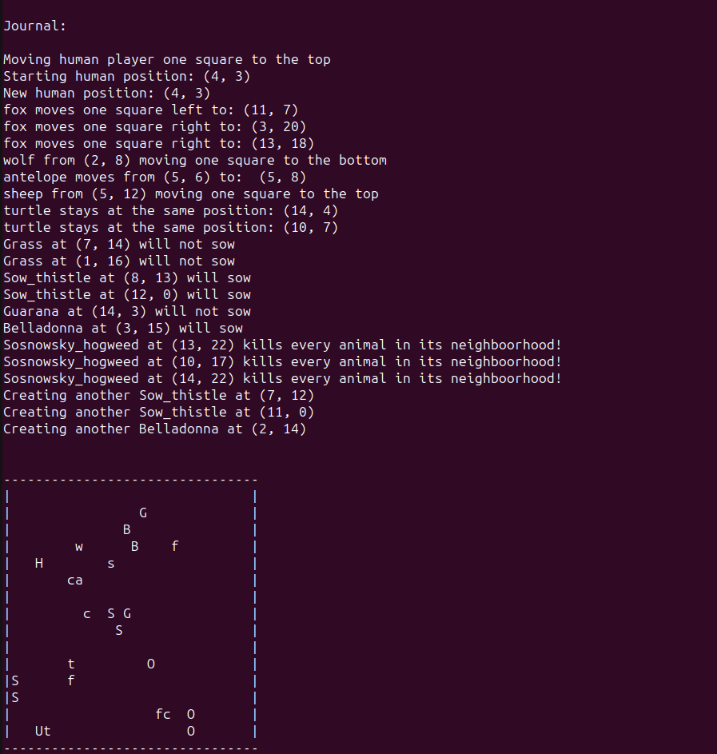

# GameOfLife

This repository contains a Game of Life simulation implemented in three programming languages: C++, Java, and Python.

- The C++ project uses the console to display the entire simulation.
- The Java implementation utilizes Swing for the graphical user interface.
- The Python version utilizes the Pygame framework for visualization.

Feel free to explore each implementation and experiment with the Game of Life simulation in different programming environments!

## Running the C++ Project

Before running the C++ project, ensure you have Microsoft Visual Studio installed on your system. Follow these steps to run the project:

1. Clone the repository to your local machine using Git:
    ```
    git clone <repository_url>
    ```

2. Open Microsoft Visual Studio.

3. Navigate to File > Open > Project/Solution and select the C++ project file (`.sln`) from the cloned repository directory.

4. Once the project is loaded in Visual Studio, press F5 or click on the green "Start" button to build and run the project.

Enjoy exploring the C++ implementation of the Game of Life in Microsoft Visual Studio!




## Running the Python Project

This is a Python GameOfLife project. To run it, you need to have Python installed along with the Pygame framework on your computer. You can check your Python version by typing:

```
python --version
```
or
```
python3 --version
```

To check if Pygame is installed, run:

```
pip show pygame
```

To get started, clone this repository using SSH or HTTP:
```
git clone <url>
```

And then execute:

```
python main.py
```
or
```
python3 main.py
```

The entire project should launch, and you should be able to play!

